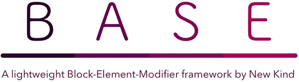

# BASE Framework #

##### Version 0.0.1 #####

BASE is a light-weight front-end framework developed by [@joshmobley](https://twitter.com/joshmobley) and [@BrentatLOOOOOP](https://twitter.com/BrentatLOOOOOP) at [@newkind](http://newkind.com).

BASE uses a BEM-style syntax along side some global modifiers to make getting a prototype built quickly, and with no baked-in style. We need something we can quickly build upon, without having to re-write or override a lot of native style that was introduced through some of the popular front-end frameworks.

## Getting Started ##

Use whatever local environment you like (we use MAMP), clone your repo into a sub-folder there.

Then simply clone this repo, run `npm install` and then run `grunt`. At this point you should be able to navigate to your localhost and see an example of the framework running.

Questions/Problems? Open an issue here or leave us a comment.